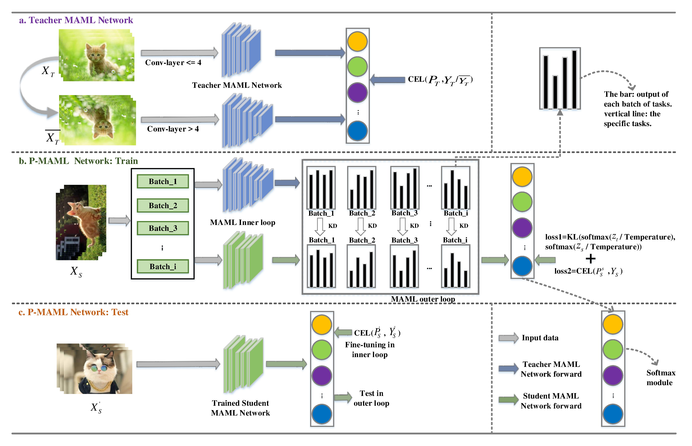

# Knowledge Distillation for Model-Agnostic Meta-Learning
PyTorch implementation of the paper:
* **Title:** Knowledge Distillation for Model-Agnostic Meta-Learning
* **Author:** <a href="https://remimz.github.io/" target="_blank">Min Zhang</a>, Donglin Wang, Sibo Gai
* **Conference:** [<a href="http://ecai2020.eu/" target="_blank">24th European Conference on Artificial Intelligence (ECAI2020)</a>]
* **More details:** [<a href="https://ecai2020.eu/papers/1264_paper.pdf" target="_blank">pdf</a>]



#### Requirements
The code runs correctly with 
 * Python 3.6 or above
 * PyTorch 1.4 or above
 * Torchvision 0.5 or above

#### How to run
```
# clone project
git clone https://github.com/remiMZ/PMAML-ECAI20.git

# Pre-train the teacher network
cd PMAML/models/teacher
# Example: run on CUB dataset, Conv-4 backbone, 1 shot, single GPU
python train.py --train-data cub --test-data cub --backbone conv4 --num-shots 1 --train-tasks 60000 
# Example: run on CUB dataset, ResNet-12 backbone, 1 shot, multiple GPUs
python train.py --train-data miniimagenet --test-data miniimagenet --backbone resnet12 --num-shots 1 --train-tasks 60000  --multi-gpu

# Train the student network 
cd PMAML/models/pmaml_every or pmaml_last
# Example: run on CUB dataset, Conv-2 backbone, 1 shot, single GPU
python train.py --train-data cub --test-data cub --backbone conv2 --num-shots 1 --train-tasks 60000 --teacher-resume --teacher-resume-recoder ''
# Example: run on CUB dataset, Conv-1 backbone, 1 shot, multiple GPUs
python train.py --train-data miniimagenet --test-data miniimagenet --backbone conv1 --num-shots 1 --train-tasks 60000 --teacher-resume --teacher-resume-recoder '' --multi-gpu
```

#### Data Preparation
You can download datasets automatically by adding `--download` when running the program. However, here we give steps to manually download datasets to prevent problems such as poor network connection:

**CUB**:
1. Create the dir PMAML/datasets/cub;
2. Download `CUB-200-2011.tgz` from <a href="https://drive.google.com/file/d/1hbzc_P1FuxMkcabkgn9ZKinBwW683j45/view" target="_blank">here</a>, and put the archive into `PMAML/datasets/cub`;
3. Running the program with `--download`;

***mini*ImageNet:**
1. Create the dir PMAML/datasets/miniimagenet;
2. Download `miniimagenet.tgz` from <a href="https://drive.google.com/file/d/16V_ZlkW4SsnNDtnGmaBRq2OoPmUOc5mY/view" target="blank">here</a>, and put the archive into `PMAML/datasets/miniimagenet`;
3. Running the program with `--download`;

**Omniglot:**
1. Create the dir PMAML/datasets/omniglot;
2. Download `omniglot.tgz` from <a href="https://drive.google.com/file/d/1INlOTyPtnCJgm0hBVvtRLu5a0itk8bjs/view" target="blank">here</a>, and put the archive into `PMAML/datasets/omniglot`;
3. Running the program with `--download`;

## Citation
If our code is helpful for your research, please cite our paper:
```
@inproceedings{Zhang2020PMAML,
  author = {Min Zhang and Donglin Wang and Sibo Gai},
  title = {Knowledge Distillation for Model-Agnostic Meta-Learning},
  booktitle = {24th European Conference on Artificial Intelligence (ECAI2020)},
  pages = {1355-1362},
  year = {2020}
}
```

## Acknowledgement
Inspired by [Torchmeta](https://github.com/tristandeleu/pytorch-meta).


